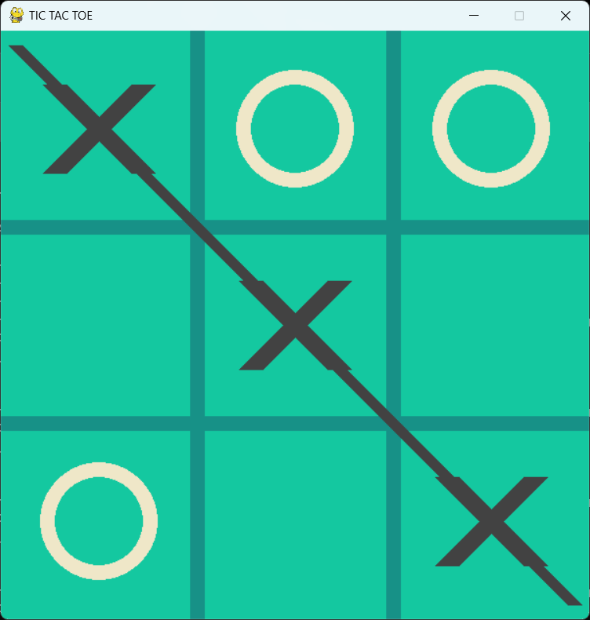
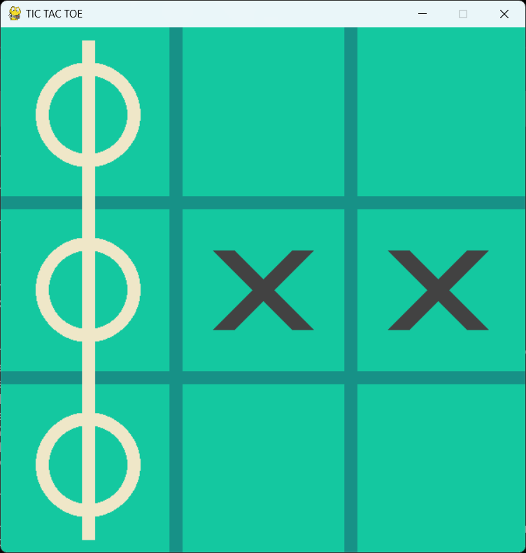

# 🎮 Tic-Tac-Toe Master AI with Q-Learning

This project is an AI-powered Tic-Tac-Toe game using **Q-Learning**, a type of Reinforcement Learning. The goal is to train an AI agent to play the game optimally by learning from experience through repeated self-play.

---

## 🧠 What is Q-Learning?

**Q-Learning** is a model-free reinforcement learning algorithm that allows an agent to learn the best action to take in a given state by receiving rewards or penalties.  
It helps the AI improve its strategy over time by learning from trial and error.

---

## 🏗️ Project Structure

```
Tic-Tac-Toe-Master-AI-with-Q-Learning/
├── training.py        # Train the AI using Q-Learning
├── play_with_ai.py    # Play against the trained AI
├── ai_eval.py         # Evaluate the trained AI’s performance
├── model.py           # Q-table structure and AI logic
├── ploter.py          # Plotting training stats (optional)
├── image/             # Visual results or training graphs
└── model/             # Saved Q-table after training
```

---

## 🚀 How to Use

### 1. Train the AI:

```bash
python training.py
```

> This script will train the AI by making it play thousands of games with itself.

---

### 2. Play against the trained AI:

```bash
python play_with_ai.py
```

> Play a real-time game against the smart agent you just trained!

---

### 3. Evaluate AI performance:

```bash
python ai_eval.py
```

> Get the win/draw/loss stats of the trained model over multiple games.

---

## 📸 Screenshots

Here are sample images of the game during and after play:

  
  


---

## 🎥 Demo Video

Watch the explanation and gameplay demo on YouTube:  
📺 [https://youtu.be/G9WlcbCnG2c](https://youtu.be/G9WlcbCnG2c)

---

## 🎓 Educational Value

This project is great for:

- Learning the basics of Reinforcement Learning
- Implementing Q-Learning from scratch
- Understanding exploration vs. exploitation in AI
- Experimenting with game-based learning models

---

## 🙌 Author

Developed by [PhoorinNickphong](https://github.com/PhoorinNickphong)

---

## 📄 License

This project is for educational purposes only and is currently not licensed.